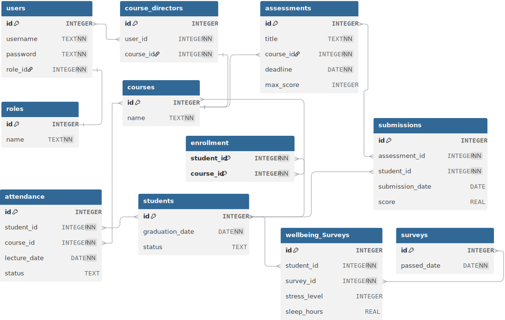

## Users
Table to store users' data
<table><thead>
  <tr>
    <th>Field Name</th>
    <th>Data Type </th>
    <th>Key </th>
    <th>Description</th>
  </tr></thead>
<tbody>
  <tr>
    <td> id</td>
    <td>INTEGER   </td>
    <td> PK   </td>
    <td> Unique Student ID (Auto-increment).   </td>
  </tr>
  <tr>
    <td>username</td>
    <td>TEXT   </td>
    <td></td>
    <td>Unique Username</td>
  </tr>
  <tr>
    <td>password</td>
    <td>TEXT   </td>
    <td></td>
    <td>Password</td>
  </tr>
  <tr>
    <td>role_id</td>
    <td>INTEGER   </td>
    <td>FK</td>
    <td> Role of the user</td>
  </tr>
</tbody>
</table>